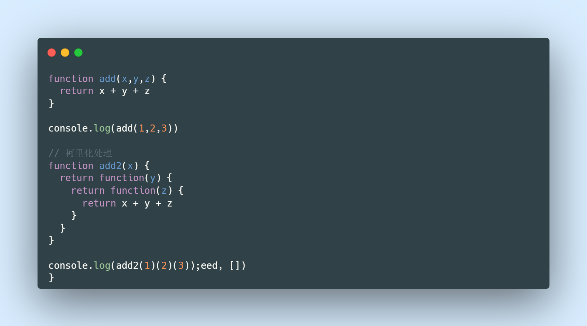
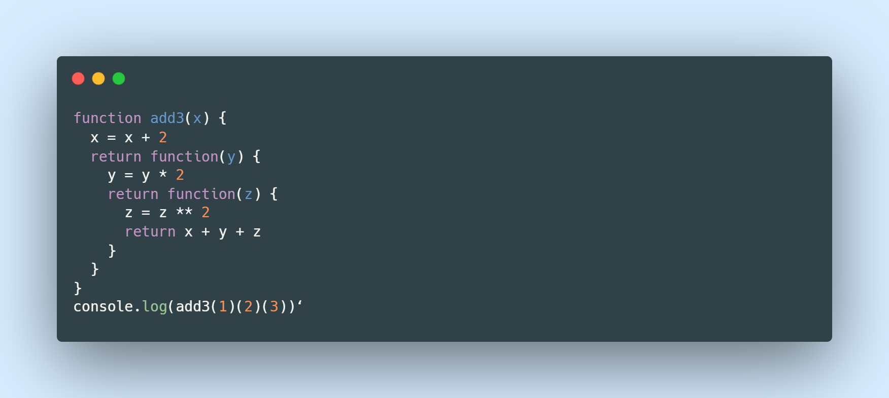
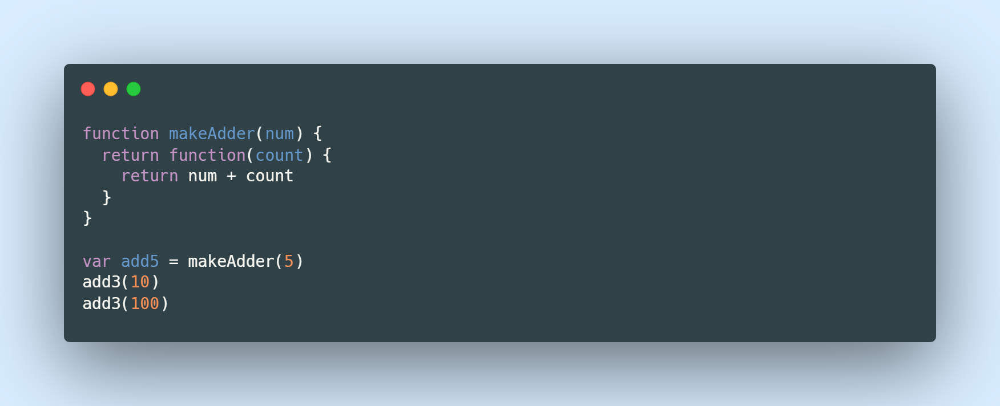
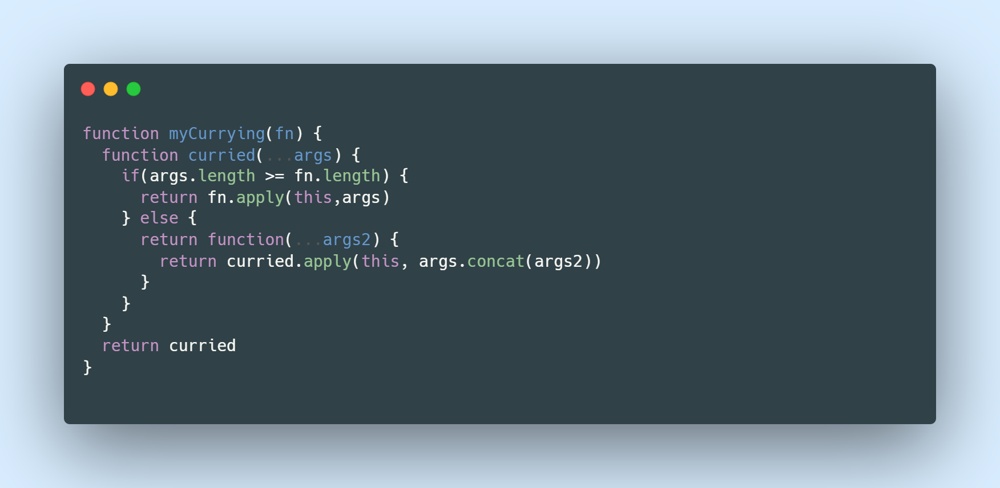

# JavaScript柯里化

柯里化(Currying)在刚听到这个名字的时候，觉得十分高大上，什么是柯里化，能干吗，有什么好处，三连击问题抛出

- 维基百科定义的柯里化

  - 是把接收多个参数的函数，变成接受一个单一参数（最初函数一个参数）的函数，并且返回接受余下的参数，而且返回结果的新函数的技术

  - 柯里化声称“如果你固定某些参数，你将得到接受余下参数的一个函数

  - 晦涩难懂...

- 总结Currying

  - 只传递给函数一部分参数来调用它，让它返回一个函数去处理剩余的参数

  

> 👿 其实这样看，会感觉多此一举，为什么需要柯里化呢，不管是代码的长度和代码的阅读性都不高

## 为什么需要柯里化呢
  
- 在函数式编程中，我们其实往往希望一个函数处理的问题尽可能单一，而不是将一大堆的处理过程交给一个函数来处理

- 那么我们是否就可以将每次传入的参数在单一的函数中进行处理，处理完后在下一个函数中再使用处理后的结果

- 传入的函数需要分别被进行处理

## 柯里化的复用

- makeAdder函数要求我们传入一个num（并且如果我们需要的话，可以在这里对num进行一些修改）

- 在之后使用返回的函数时，我们不需要再继续传入num了

> 💡 同样这里使用到了闭包的知识，add5为闭包，num保存的是5，同理也可以创建一个add10，num保存的就是10，相同的函数，保存了不同的词法环境

## 实现自动柯里化

1. 返回的都是函数

2. 参数的判断

3. 解决this指向

>  🌤️ 具体的步骤可参照项目源码
