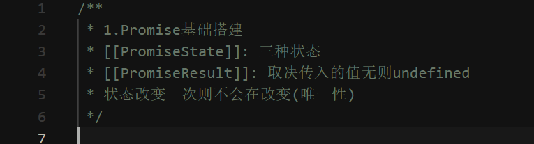

## 手写Promise

> ⚠️ 适合了解Promise特性  
> ⚠️ 遵循PromiseA+规范实现

### 特色💭

- 通过Test代码去一步步的编写

- 提供分步骤代码可供学习

- 提供注解

### 如何食用🍫

1. 找到Test代码

2. 根据序号找到相对应的分解代码

例如：

1.Promise基础搭建，打开对应的``1.Promise.js``就可以看针对测试实现的代码

3. 类似一种通过模式，解决一个一个模块的test，我们的手写Promise就根据一步了!🙋🏻

### 动起来吧! 🧑🏻‍💻