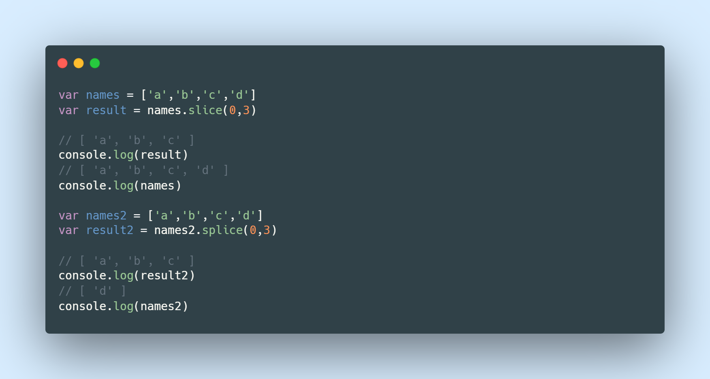
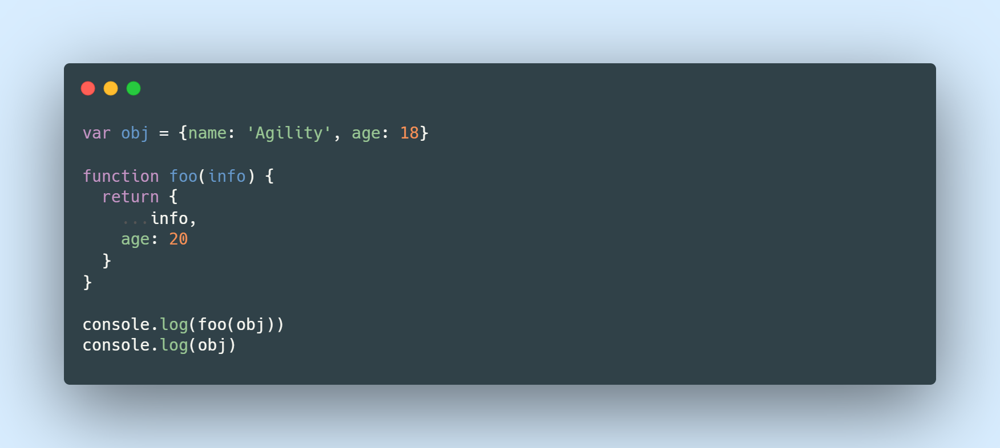

# JavaScript纯函数

- 维基百科定义的纯函数

  - 此函数在相同的输入值时，需产生相同的输出。
  - 函数的输出和输入值以外的其他隐藏信息或状态无关，也和由I/O设备产生的外部输出无关。
  - 该函数不能有语义上可观察的函数副作用，诸如“触发事件”，使输出设备输出，或更改输出值以外物件的内容等

- 总结纯函数

  - 同一输入，输出结果必然相同
  - 在执行过程中，除了返回函数值以外，不能有附加的效果(👇🏻)

## 纯函数的案例

- 对数组进行操作的两个函数

  - slice: 当我们操作完数组，并不会对原数组进行改变，且不产生副作用，则它为**纯函数**

  - splice：当我们操作完数组，原数组也会改变，不符合纯函数的定义

- 只要满足(同一输入输出一致、执行过程中不产生副作用)则就为纯函数

## 纯函数的作用 

明白了什么是纯函数之后，该想想纯函数能给我们带来什么呢?

- 可以安心的编写和安心的使用(不会产生副作用)这就好比，纯函数，它只是单单的写函数里面的逻辑

- 有确定的输出，在进行测试的时候也会更加容易

> 🎯 在编写代码的时候，我们尽量使用纯函数，如：数组中的(slice,map,forEach,filter,reduce等)